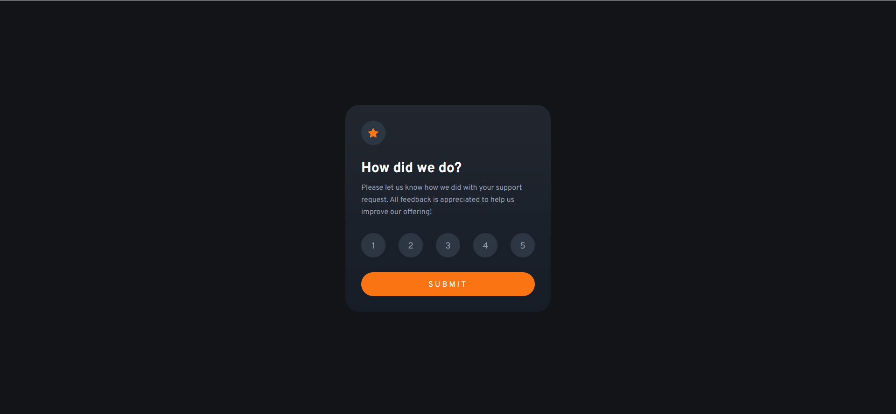
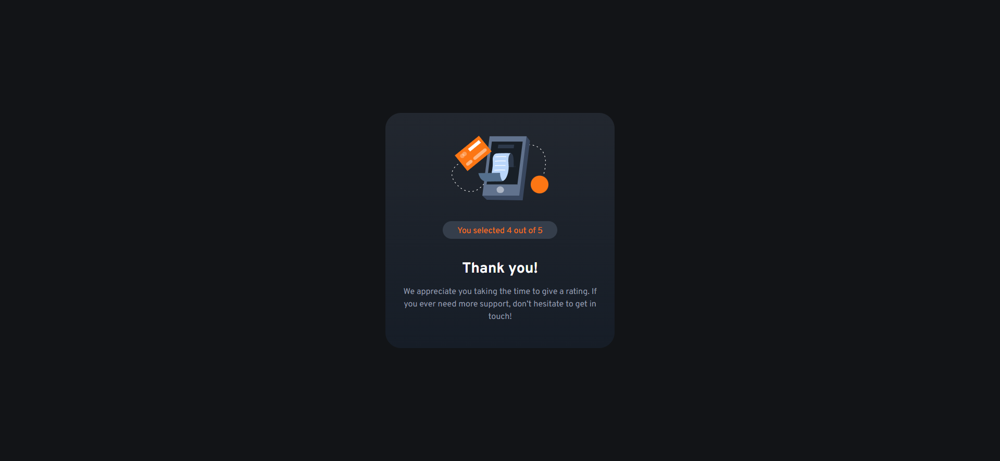
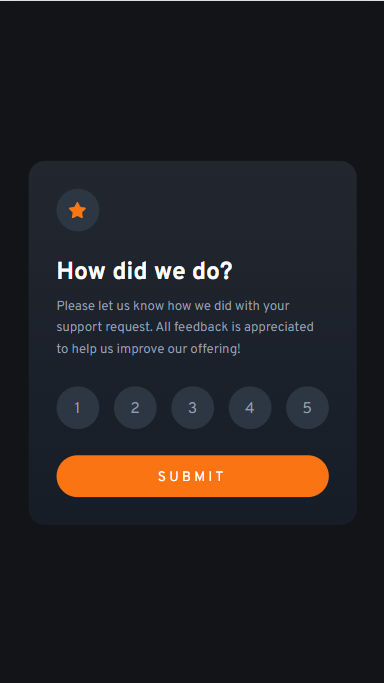

# Frontend Mentor - Interactive rating component solution

This is a solution to the [Interactive rating component challenge on Frontend Mentor](https://www.frontendmentor.io/challenges/interactive-rating-component-koxpeBUmI).

## Table of contents

- [Overview](#overview)
  - [The challenge](#the-challenge)
  - [Screenshot](#screenshot)
  - [Links](#links)
- [My process](#my-process)
  - [Built with](#built-with)
  - [Useful resources](#useful-resources)

## Overview

### The challenge

Users should be able to:

- View the optimal layout for the app depending on their device's screen size
- See hover states for all interactive elements on the page
- Select and submit a number rating
- See the "Thank you" card state after submitting a rating

### Screenshot

- Desktop View

- Mobile View

    

### Links

- Solution URL: https://github.com/priyanshu-mishr/interactive-rating-component.git
- Live Site URL: https://priyanshu-mishr.github.io/interactive-rating-component/

## My process

### Built with

- Semantic HTML5 markup
- CSS custom properties
- Flexbox
- Vanilla JS

### Useful resources

- [Google Fonts](https://fonts.google.com/) 

## Author

Frontend Mentor - [@priyanshu-mishr](https://www.frontendmentor.io/profile/priyanshu-mishr)
